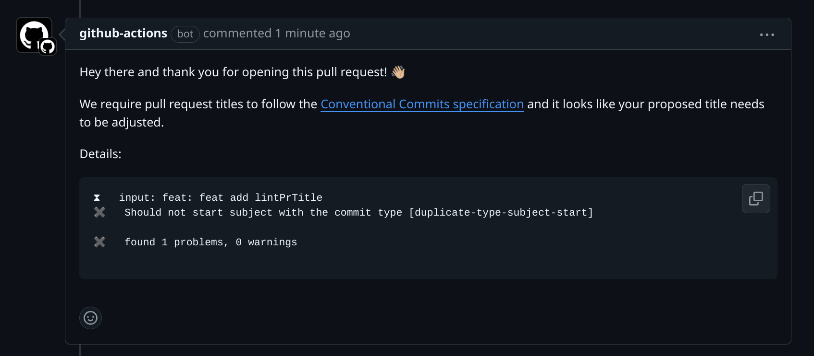

# action-conventional-pull-request

This is a GitHub Action that ensures that your pull request titles match the [Conventional Commits spec](https://www.conventionalcommits.org/). Typically, this is used in combination with a tool like [semantic-release](https://github.com/semantic-release/semantic-release) to automate releases.

This action uses [commitlint](https://commitlint.js.org/) to parse and validate PR titles

## Examples

**Valid pull request titles:**

- fix: Correct typo
- feat: Add support for Node.js 18
- refactor!: Drop support for Node.js 12
- feat(ui): Add `Button` component

> Note that since pull request titles only have a single line, you have to use `!` to indicate breaking changes.

See [Conventional Commits](https://www.conventionalcommits.org/) for more examples.

## Installation

1. If your goal is to create squashed commits that will be used for automated releases, you'll want to configure your GitHub repository to [use the squash & merge strategy](https://docs.github.com/en/repositories/configuring-branches-and-merges-in-your-repository/configuring-pull-request-merges/configuring-commit-squashing-for-pull-requests) and tick the option "Default to PR title for squash merge commits".
2. [Add the action](https://docs.github.com/en/actions/quickstart) with the following configuration:

```yml
name: 'Lint PR'

on:
  pull_request_target:
    types:
      - opened
      - edited
      - synchronize
      - reopened

permissions:
  contents: read
  pull-requests: write

jobs:
  main:
    name: Validate PR title
    runs-on: ubuntu-latest
    steps:
      - uses: lwhiteley/action-conventional-pull-request@v1
        env:
          GITHUB_TOKEN: ${{ secrets.GITHUB_TOKEN }}
```

See the [event triggers documentation](#event-triggers) below to learn more about what `pull_request_target` means.

## Configuration

The action works without configuration, however you can provide options for customization.

Please see the useful links of commitlint to understand how to configure/override rules:

- https://commitlint.js.org/reference/rules.html
- https://commitlint.js.org/reference/configuration.html#configuration-object-example
- https://commitlint.js.org/reference/rules-configuration.html
- https://commitlint.js.org/concepts/commit-conventions.html

```yml
with:
  # Configure path to a custom commitlint
  # config file within the repository.
  # This config will be loaded last and take the highest priority.
  # This file must export a commitlint config as the default export
  # Example: ./.github/commitlint.js
  config_file: ''
```

## Custom commitlint rules

This action adds custom commitlint rules that can be overriden as well

```js
{
  rules: {
      /**
       * This rule checks if the commit subject starts with the commit type.
       *
       * Samples:
       * Invalid => fix: fix something
       * Correct => fix: something
       */
      'duplicate-type-subject-start': [2, 'always'],

      /**
       * This rule checks if the commit type is duplicated.
       *
       * Samples:
       * Invalid => fix: fix: fix something
       * Correct => fix: something
       */
      'duplicate-commit-type': [2, 'always']
   }
}
```

## Event triggers

There are two events that can be used as triggers for this action, each with different characteristics:

1. [`pull_request_target`](https://docs.github.com/en/actions/reference/events-that-trigger-workflows#pull_request_target)
2. [`pull_request`](https://docs.github.com/en/actions/reference/events-that-trigger-workflows#pull_request)

## Outputs

- `pr_title` - The title of the pull request
- `pr_number`: The pull request number
- `valid` - boolean as string to determine if the title is valid or not
- `outcomes` - structured `Array<Outcome>` as JSON string of the validation feedback

  ```ts
  type Problem = {
    // Level of the problem hint | warning | error
    level: 0 | 1 | 2;

    // Name of the problem to annotate the message with
    name: string;

    // Message to print
    message: string;
  };

  type Outcome = {
    input: string;
    errors: Problem[];
    warnings: Problem[];
  };
  ```

- `report` - The formatted string report of the validation outcomes

[Outputs can be used in other steps](https://docs.github.com/en/actions/using-jobs/defining-outputs-for-jobs), for example to comment the error message onto the pull request.

<details>
<summary>Example</summary>

````yml
name: 'Lint PR'

on:
  pull_request_target:
    types:
      - opened
      - edited
      - synchronize

permissions:
  contents: read
  pull-requests: write

jobs:
  main:
    name: Validate PR title
    runs-on: ubuntu-latest
    steps:
      - uses: lwhiteley/action-conventional-pull-request@v1
        id: lint_pr_title
        env:
          GITHUB_TOKEN: ${{ secrets.GITHUB_TOKEN }}

      - uses: marocchino/sticky-pull-request-comment@v2
        # When the previous steps fails, the workflow would stop. By adding this
        # condition you can continue the execution with the populated error message.
        if: always() && (steps.lint_pr_title.outputs.valid == 'false')
        with:
          header: pr-title-lint-error
          message: |
            Hey there and thank you for opening this pull request! 👋🏼

            We require pull request titles to follow the [Conventional Commits specification](https://www.conventionalcommits.org/en/v1.0.0/) and it looks like your proposed title needs to be adjusted.

            Details:

            ```
            ${{ steps.lint_pr_title.outputs.report }}
            ```

      # Delete a previous comment when the issue has been resolved
      - if: ${{ steps.lint_pr_title.outputs.valid == 'true' }}
        uses: marocchino/sticky-pull-request-comment@v2
        with:
          header: pr-title-lint-error
          delete: true
````

</details>



## Tips

- https://github.com/ccnnde/commitlint-config-git-commit-emoji/blob/master/index.js
- https://github.com/ballcat-projects/commitlint-config-gitmoji/blob/master/index.js

Inspirations for this action:

- https://github.com/amannn/action-semantic-pull-request
